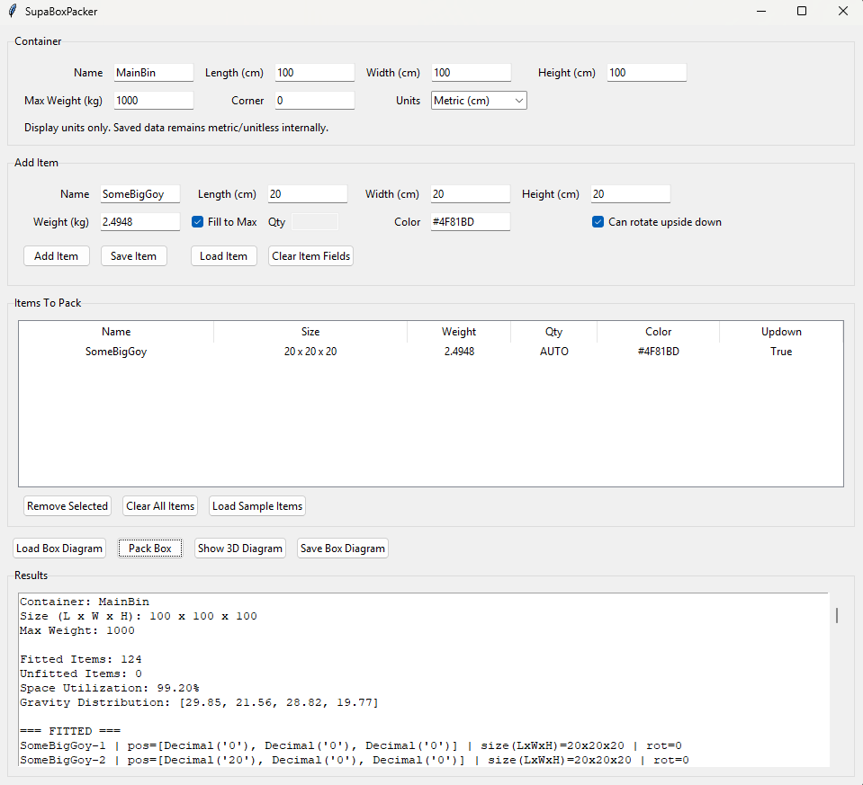

# SupaBoxPacker 📦

A simple desktop GUI for experimenting with **3D bin packing algorithms**.

SupaBoxPacker lets you visually test how items fit inside a container and generate a 3D diagram of the packed result.

Built in Python using:

- Tkinter GUI
- py3dbp packing algorithm
- matplotlib 3D visualization

---

# [Releases](https://github.com/JustinHammitt/3D-bin-packing-PYGUI/releases)
[v1.1.0 Full Pack!](https://github.com/JustinHammitt/SupaBoxPacker/releases/tag/v1.1.0)

# Past Releases
[v1.0.14 Base release](https://github.com/JustinHammitt/SupaBoxPacker/releases/tag/v1.0.14)


---

# Features

✔ Simple GUI interface  
✔ Add / remove items quickly  
✔ Save and load item presets  
✔ Save and load full box diagrams  
✔ Automatic packing algorithm  
✔ 3D visualization of packed items  
✔ Export layouts to JSON  
✔ Windows EXE build via GitHub Actions  
✔ v1.1  Fill to Max

---

# Roadmap (Subject to change)

- Todo: Seperate funcs not gui relatd from gui.py 
- v1.2  Item Padding
- v1.3  Container Padding
- v1.4  Multi-item Fill to Max
- v1.5  Void Detection

---

# Screenshots

### Main Interface



### Packed 3D Diagram


---

# Example Workflow

1. Define container size
2. Add items to pack
3. Click **Pack Box**
4. View results
5. Open **3D Diagram**

You can also save layouts and item templates for reuse.

---

# Example Item Template

```json
{
  "name": "BoxA",
  "WHD": [20, 20, 20],
  "weight": 5,
  "qty": 3,
  "color": "#FF6666",
  "updown": true
}
```

---

# Project Structure

```
SupaBoxPacker/
│
├─ gui.py
├─ requirements.txt
│
├─ .github/
│  └─ workflows/
│     └─ build-windows.yml
│
└─ images/
   ├─ gui-main.png
   └─ gui-diagram.png
```

---

# Build From Source

```
pip install -r requirements.txt
python gui.py
```

---

# Build Windows EXE

```
pyinstaller --onefile --windowed gui.py
```

---

# Credits

Packing algorithm powered by:

**py3dbp**

Visualization powered by:

**matplotlib**

The Real Hero's:

GUI Frontend fork based off https://github.com/jerry800416/3D-bin-packing and the og repo credited by jerry https://github.com/enzoruiz/3dbinpacking

---

# License

MIT License
